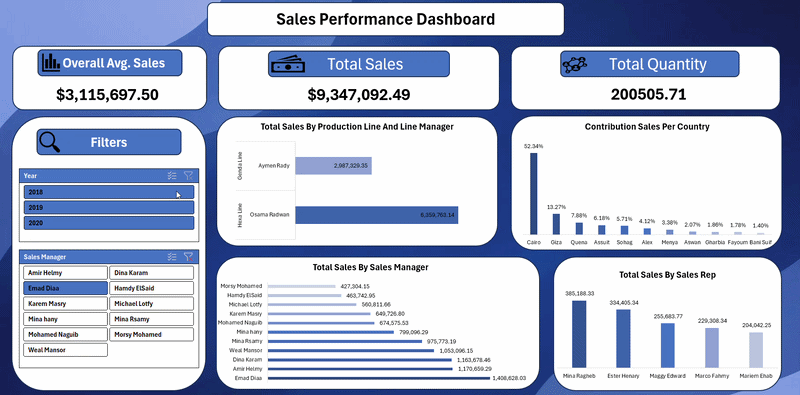

# 📊 Sales Dashboard (Excel)

## 📌 Project Overview
This project presents an interactive sales dashboard built using Microsoft Excel to analyze and visualize sales performance across different dimensions.

________________________________________

## 🛠 Tools Used
• Excel  
• Pivot Tables  
• Data Visualization  

________________________________________

## 📂 Project Steps
1. Data Cleaning  
2. Data Analysis  
3. Data Visualization  
4. Dashboard Creation  

________________________________________

## 📊 Key Metrics
• Total Sales  
• Total Quantity  
• Average Sales  
• Sales by Country  
• Sales by Managers  
• Sales by Sales Representatives  

________________________________________

## ⚡ Features
• Interactive filters (Year, Sales Manager)  
• Dynamic dashboard updates  
• Clear and simple design  
• Easy comparison between different segments  

________________________________________

## 📈 Dashboard Preview

________________________________________

## 🎥 Demo

________________________________________

## 🔍 Key Insights
• Sales performance varies significantly across countries  
• Some sales reps outperform others consistently  
• Filtering helps identify trends by year and manager  

________________________________________

## 👨‍💻 Author
Ahmed Elemam – Data Analysis
